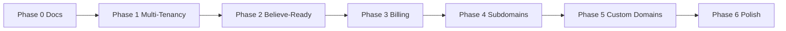

# Product Roadmap — Believe-Readiness & SaaS

Branch: `feature/believe-readiness-roadmap` · Basis: `dev` · Stand: Juni 2026

## Übersicht



| Phase | Ziel | Aufwand | Status |
|-------|------|---------|--------|
| 0 | Strategie-Dokumentation | 1–2 Wochen | ✅ |
| 1 | Multi-Tenancy-Grundlage | 4–8 Wochen | ✅ MVP |
| 2 | Believe-Readiness (API, Export, Analytics) | 6–10 Wochen | ✅ |
| 3 | Stripe Billing & Provisioning | 7–10 Wochen | ✅ |
| 4 | Subdomains + White-Label | 4–6 Wochen | ✅ |
| 5 | Custom Domains + SSL | 4–6 Wochen | ✅ |
| 6 | Production SaaS Polish | 3–4 Wochen | ✅ |

**Gesamt SaaS-MVP:** 6–8 Monate · **Mit Believe-Readiness:** 8–12 Monate

---

## Phase 0 — Strategie (abgeschlossen)

Dateien in `docs/strategy/`:

- [`valuation.md`](valuation.md)
- [`reprtoir-gap-analysis.md`](reprtoir-gap-analysis.md)
- [`believe-readiness.md`](believe-readiness.md)
- [`believe-pitch.md`](believe-pitch.md)
- Dieses Dokument

---

## Phase 1 — Multi-Tenancy-Grundlage

### Schema (neu in `supabase/reset.sql`)

```sql
organizations          -- id, name, slug, status
organization_users     -- organization_id, user_id, role
organization_branding  -- logo, colors, favicon per org
```

- Sentinel-UUID `00000000-0000-0000-0000-000000000000` = darkTunes (Tenant 0)
- Später: `organization_id` auf Kern-Tabellen (`artists`, `releases`, …)
- RLS: strikte Org-Isolation + E2E in `tests/e2e/rls-validation`

### Code

- `src/lib/organizations/constants.ts` — `DEFAULT_ORGANIZATION_ID`
- `src/lib/api/organizations.ts` — DAL
- Middleware: Org-Kontext (später Subdomain)
- Super-Admin: Tenant-Übersicht (Phase 6)

**Deliverable:** Zwei isolierte Test-Orgs, darkTunes als Tenant 0.

---

## Phase 2 — Believe-Readiness

### 2a. Partner-API v1 ✅

- `app/api/v1/*` mit API-Key-Auth, Scope `read`, Cursor-Pagination
- Endpoints: Artists, Releases, Submissions (list + by id), Analytics-Export
- Admin: API-Keys + Webhook-Endpunkte in `/admin/organizations`
- Outbound Webhooks: `artist.created`, `release.submitted`, `release.approved`, `release.rejected`
- Doku: [`api-v1.md`](api-v1.md)

### 2b. Believe Release-Export ✅

- `src/lib/releases/believeExport.ts` — Validierung + JSON/CSV
- `GET /api/admin/release-submissions/[id]/export-believe`
- Admin-UI: Export-Button bei `accepted`/`reviewed`, Warnungen via Toast

### 2c. Analytics-Export ✅

- Portal: CSV-Download (bereits in `AnalyticsPageClient`)
- API: `GET /api/v1/analytics/export?format=csv|json`
- Tests: `reportExport.test.ts`, `v1AnalyticsRoute.test.ts`

### 2d. Demo-Flow ✅

- [`demo-flow.md`](demo-flow.md) — Live-Pitch-Script für Believe

**Deliverable:** API-Doku + Live-Demo + Export-Flow evaluierbar.

---

## Phase 3 — SaaS Billing

- Stripe Checkout, Subscriptions, Webhook `app/api/stripe/webhook`
- Tabellen: `plans`, `subscriptions`, `plan_features`
- Self-Service: Registrierung → Org → Plan
- Feature Gating: `organization_features`

---

## Phase 4 — Subdomains + White-Label

- Wildcard `*.darktunes.app`
- Middleware: Subdomain → `organization_id`
- Dynamisches Branding aus `organization_branding`
- Tenant-Provisioning nach Checkout

---

## Phase 5 — Custom Domains

- Tabelle `custom_domains` + TXT-Verifizierung
- Cloudflare Custom Hostnames
- Dashboard: Domain-Status, Fallback Subdomain

---

## Phase 6 — Production Polish

- Org-scoped Audit Logs
- Super-Admin Dashboard (Tenants, MRR)
- GDPR Export/Löschung pro Org
- E2E: Billing, Domains, RLS
- Onboarding-Guides für neue Labels

---

## Bewusst out of scope

- Reprtoir-Level: 180+ Statement-Provider, Contracts/Rights
- Believe-API-Integration (nur CSV + Export-Assistent)
- Audio-AI, Playlist-Sharing
- Vollständiges Redesign weg von CRT-Ästhetik

---

## Erfolgskriterien

| Meilenstein | Kriterium |
|-------------|-----------|
| Phase 0 | 5 Strategy-Docs committed |
| Phase 1 | 2 Test-Orgs, RLS-E2E grün |
| Phase 2 | OpenAPI v1, Believe-Export, Portal-CSV getestet |
| Phase 3–6 | Stripe-Checkout → Subdomain → Custom Domain in Staging |
| Believe-Pitch | Demo-Script + API-Doku + ROI-Template |

---

## Risiken

| Risiko | Mitigation |
|--------|------------|
| RLS-Refactor bricht Produktion | Tenant 0 = darkTunes; Feature-Flag; RLS-E2E zuerst |
| Believe lehnt ab | Pitch auf Pilot/Consulting |
| Scope Creep | Phasen 1–2 vor 3–6 |
| Schema | Nur `reset.sql` + `database.ts` — keine `migrations/` |